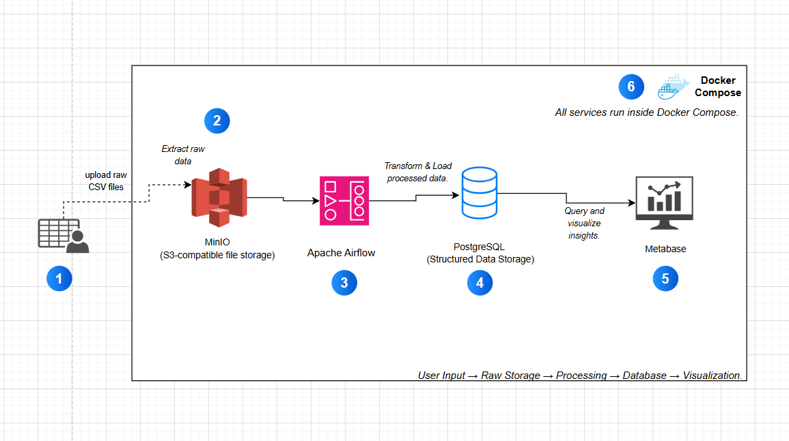
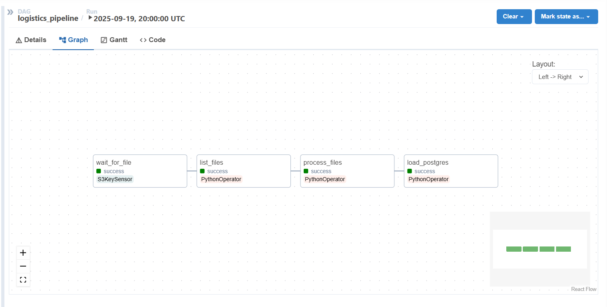
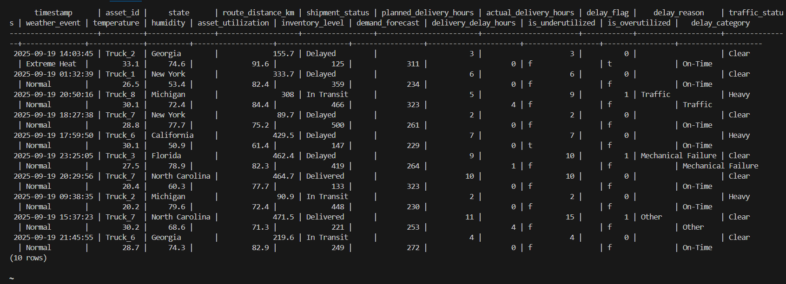
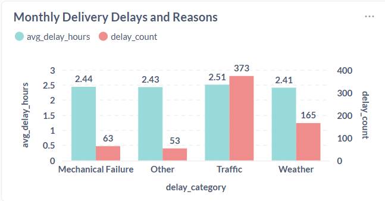
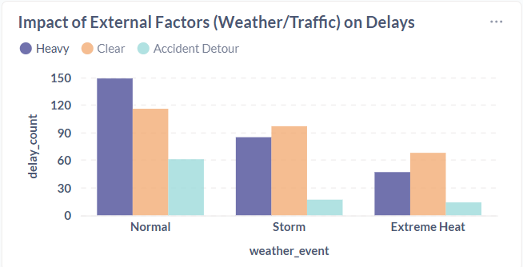

# Mini Data Platform

End-to-End ETL Pipeline with Docker for Logistics and Supply Chain Analytics

## Overview

This project is a lightweight end-to-end ETL data platform for logistics and supply chain analytics, built entirely with Docker Compose. It demonstrates how teams can collect, process, store, and visualize data to directly drive business value.

## Architecture

The Mini Data Platform integrates four core open-source components:

- **PostgreSQL** – Relational database for structured data storage
- **Apache Airflow** – Orchestrates and schedules ETL pipelines
- **MinIO** – Scalable, S3-compatible file storage for raw data
- **Metabase** – Interactive dashboards and reports for analytics

**Data Flow:** Upload raw CSV files → Airflow processes and cleans data → Results stored in PostgreSQL → Metabase visualizes insights



## Prerequisites

Before running the project, ensure you have the following installed and configured:

- Python 3.8+
- Docker

## Installation

1. Clone the repository:
   ```bash
   git clone https://github.com/Eugenia-DE/mini-data-platform.git
   cd mini-data-platform
   ```

## Configuration

### Environment Setup

Create a `.env` file with the following required environment variables:

```bash
# Postgres
POSTGRES_USER="your postgres user"
POSTGRES_PASSWORD="your postgres password"
POSTGRES_DB="your logistics database name"

# MinIO
MINIO_ROOT_USER=
MINIO_ROOT_PASSWORD=

# Airflow
AIRFLOW_USER=
AIRFLOW_PASSWORD=
AIRFLOW_EMAIL=admin@example.com
AIRFLOW_FERNET_KEY=
AIRFLOW_SECRET_KEY=

# MinIO credentials
MINIO_ENDPOINT=
MINIO_ACCESS_KEY=
MINIO_SECRET_KEY=
MINIO_BUCKET=
```

### Generate Airflow Keys

To generate the required Airflow keys, open PowerShell and run:

**For AIRFLOW_FERNET_KEY:**
```bash
python -c "import base64, os; print(base64.b64encode(os.urandom(32)).decode())"
```

**For AIRFLOW_SECRET_KEY:**
```bash
python -c "import secrets; print(secrets.token_hex(32))"
```

## Usage

### Step 1: Start Docker Services

```bash
docker-compose up -d
```

To stop Docker services:
```bash
docker-compose down
```

### Step 2: Generate Sample Data

Generate data using the data generator script:

```bash
python data_generator.py
```

For specific parts (mimicking a staggered upload):
```bash
python generator.py --date 2025-09-18 --part 2
```

### Step 3: Verify Data in MinIO

1. Open your browser and navigate to the MinIO console: http://localhost:9001
2. Log in using the credentials from your `.env` file
3. Navigate to **Buckets** in the left sidebar
4. Click on your bucket name to view the generated CSV files

### Step 4: Deploy DAG to Airflow

The project uses Docker Compose with mounted folders. Airflow will automatically detect new DAGs placed in the `dags/` directory.

### Step 5: Trigger the DAG

1. Open the Airflow UI: http://localhost:8080
2. Turn on the DAG toggle to enable scheduling
3. Either:
   - Let it run automatically (scheduled to run 3 times per day: 8 AM, 2 PM, 8 PM)
   - Manually trigger it using the **Trigger DAG** button

### Step 6: Monitor Execution

In the Airflow UI, use **Graph View** or **Gantt View** to track task progress. The pipeline consists of:

- **wait_for_file** – Waits for partial data files uploaded to MinIO
- **list_files** – Lists all files available for the given day
- **process_files** – Downloads, validates, and transforms each dataset
- **load_postgres** – Loads clean, deduplicated logistics data into PostgreSQL

Failed tasks can be retried directly from the UI.



### Step 7: Verify Results in PostgreSQL

Connect to PostgreSQL via CLI:
```bash
docker exec -it postgres psql -U "your postgres user name" -d "your postgres database name"
```

Run validation queries:
```sql
SELECT COUNT(*) FROM your_postgres_database_name;
SELECT * FROM your_postgres_database_name LIMIT 10;
```



### Step 8: View Insights in Metabase

1. Open Metabase: http://localhost:3000
2. Connect to the PostgreSQL instance (logistics_data table)
3. Saved Questions and Dashboards will automatically reflect new data after each DAG run

## Sample Analytics Results

### Monthly Logistics Delivery Delays by Root Cause



The analysis highlights traffic-related issues as the single largest driver of delays in September, both in frequency and duration. Mechanical failures and weather events, while less frequent, also contribute notable inefficiencies. This chart helps prioritize resource allocation towards traffic management strategies and predictive maintenance.

### External Factors Affecting Logistics Delays



Even under normal weather conditions, heavy traffic remains the largest external factor impacting delivery reliability. During adverse events like storms, delays spike across all categories, showing that contingency planning is essential. Extreme heat, though less common, introduces unique risks that could increase with climate trends.

## Troubleshooting

### Airflow Issues

**Problem:** Airflow webserver or scheduler not running
```bash
docker-compose restart airflow-webserver airflow-scheduler
```

**Problem:** DAG not appearing in UI
- Ensure the `.py` DAG file is in the `dags/` folder
- Check for syntax errors: `docker-compose logs airflow-scheduler`
- Restart scheduler if needed

**Problem:** Task failure during execution
- Check Airflow UI → DAG → Task → Logs for specific errors
- Verify database connections and container status

### Database Issues

**Problem:** Database connection errors
```bash
# Check if PostgreSQL is running
docker ps | grep postgres

# Check container status
docker-compose ps
```

**Problem:** Stale data in PostgreSQL
- Ensure DAG run completed successfully
- Verify deduplication logic is running
- For development, manually truncate: `TRUNCATE TABLE logistics_data;`

### Storage Issues

**Problem:** No data in MinIO bucket
```bash
# Check MinIO logs
docker logs minio

# Restart services
docker-compose down
docker-compose up -d
```

### Visualization Issues

**Problem:** Metabase dashboards not updating
- Verify Metabase database connection is active
- Set dashboard auto-refresh interval
- Manually run saved questions to force refresh

## Repository Structure

```
mini-data-platform/
├── dags/                   # Airflow DAG files
├── assets/images/          # Documentation images
├── docker-compose.yml      # Docker services configuration
├── data_generator.py       # Sample data generation script
├── .env                    # Environment variables
└── README.md              # This documentation
```

## Contributing

1. Fork the repository
2. Create a feature branch
3. Make your changes
4. Submit a pull request

